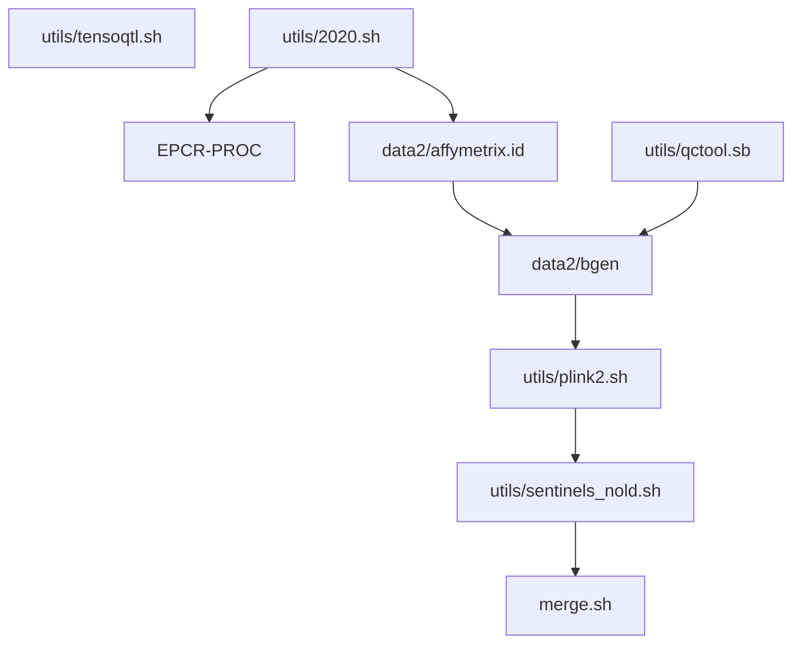

# Caprion work

* [caprion.R](caprion.R) and [caprion.ini](caprion.ini) are for data processing. Their derivatives are in the utils/ subdirectory:
  * [utils/affymetrix.sh](utils/affymetrix.sh) is for variant-specific association analysis.
  * [utils/qctool.sb](utils/qctool.sb) is used to extract available sample and genotypes.
  * [utils/qctool.sh](utils/qctool.sh) further extracts genotypes with MAF 0.01 only.
  * [utils/plink2.sh](utils/plink2.sh) non-SLURM version of association analysis.
  * [utils/qqman.sh](utils/qqman.sh) and [utils/qqman.R](utils/qqman.R) produce QQ and Manhattan plots.
  * [utils/sentinels_nold.sh](utils/sentinels_nold.sh) and [utils/merge.sh](utils/merge.sh) select sentinels.
  * [utils/ps.sh](utils/ps.sh) and [utils/ps.R](utils/ps.R) run through PhenoScanner.
  * [utils/lookup.sh](utils/lookup.sh) looks up for overlap with SomaLogic and Olink.
* [caprion.ipynb](caprion.ipynb) is a Jupyter notebook with some preprocessing done by [utils/tensorqtl.sh](utils/tensorqtl.sh).
* Phase II work

---

## autoencoder (AE) vs PCA

As shown at <a href="https://www.r-bloggers.com/pca-vs-autoencoders-for-dimensionality-reduction/">R-bloggers</a>,

> autoencoder is better at reconstructing the original data set than PCA when k is small, 
> however the error converges as k increases. For very large data sets this difference will be
> larger and means a smaller data set could be used for the same error as PCA. When dealing 
> with big data this is an important property`.

where `k` corresponds to the number of principal components in PCA or bottleneck dimension in AE.

The local adoption is [ae_test.Rmd](utils/ae_test.Rmd) which produces [ae_test.html](utils/ae_test.html) and [ae_test.pdf](utils/ae_test.pdf).

Additional work will be on variatinoal autoencoder (VAE) as indicated in the references below.

## REFERENCES

Hofert M, Prasad A, Zhu M (2019). Quasi-Monte Carlo for multivariate distributions viagenerative neural networks. https://arxiv.org/abs/1811.00683, https://CRAN.R-project.org/package=gnn.

Kingma DP, Welling M (2014). Auto-Encoding Variational Bayes. https://arxiv.org/abs/1312.6114, https://keras.rstudio.com/articles/examples/variational_autoencoder.html.

Trivadis SK (2017). Variational autoencoders for anomaly detection. https://rpubs.com/zkajdan/308801.

## URLs

https://github.com/diazale/gt-dimred,
https://github.com/lmcinnes/umap,
https://umap-learn.readthedocs.io/en/latest/.

