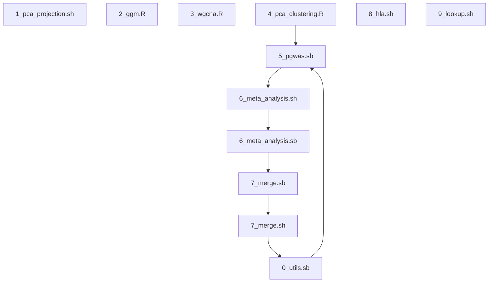

# Protein analysis
<a href="https://jinghuazhao.github.io/Caprion/"></img></a>
## Programs[^directory]

Work was done in a named sequence[^workflow].

```
1_pca_projection.sh
2_ggm.R
3_wgcna.R
4_pca_clustering.R
5_pgwas.sh
6_meta_analysis.sh
7_merge.sh
8_hla.sh
9_lookup.sh
```



Chromose X is handled together with autosomes, and the loop from `0_utils.sb` to `5_pgwas.sb` is to produce mean-by-genotype/QQ/Manhattan/LocusZoom plots -- the former also implements vep_annotate(), fp_data(), fp() which only requires `--array=1`. Note also that HetISq() only works inside an interactive R session.

## 1. Data handling and PCA projection

The pipeline follows HGI contributions nevertheless only serves for reassurance since the study samples were carefully selected.

## 2. GGM

The results are ready to report.

## 3. WGCNA

This can be finalised according to the Science paper.

## 4. PCA and clustering

The groupings based on unfiltered and DR-filtered proteins can be made on three phases altogether and instead of a classification indicator the first three PCs are used.

The PLINK2 has been used in the pilot studies, but now fastGWA using double transformations of the phenotypic data similar to SCALLOP-Seq analysis. Amazingly, a standard assignment statement inside `sapply()` would produce `.pheno`/`.mpheno` containing the raw data.

The file also includes experiments on normalisation.

## 5. pGWAS[^pGWAS]

The `bgen` files were extracted from a list of all samples, the variant IDs of which were for all RSids to allow for multiallelic loci.

The (sb)atch file is extended to produce Q-Q/Manhattan/LocusZoom plots and extreme p values are possible for all plots. Note that LocusZoom 1.4 does not contain 1000Genomes build 37 genotypes for chromosome X and therefore they are supplemented with local files in the required format, namely, `locuszoom_1.4/data/1000G/genotypes/2014-10-14/EUR/chrX.[bed, bim, fan]`. Now that for the Manhattan plot call for VEP is necessary from `0_utils.sb`, which also produces mean by genotype/dosage plots.

## 6. Meta-analysis

Internally, this follows from the SCALLOP/INF implementation, as designed analogous to a Makefile, i.e.,

```bash
6_meta_analysis <task>
```

where task = METAL_list, METAL_files, METAL_analysis, respectively in sequence. However, due to time limit on HPC, a call to `.sb` is made for meta-analysis.

To extract significant variants one may resort to `awk 'NR==1||$12<log(1e-6)/log(10)' 1433B-1.tbl`, say.

## 7. Variant identification

An iterative merging scheme is employed; the HLA region is simplified but will be specifically handled. Somewhat paradoxically, forest plots are also obtained here[^metal].

A SLURM job is executed, to be followed by collection of results.

## 8. HLA imputation[^HLA]

This is experimented on several software including HIBAG, CookHLA and SNP2HLA as desribed [here](https://cambridge-ceu.github.io/csd3/applications/CookHLA.html). The whole cohort imputation requests resources exceeding the system limits, so a cardio SLURM job is used instead.

The hped file from CookHLA (or converted from HIBAG) can be used by HATK for association analysis while the advantage of SNP2HLA is that binary ped files are ready for use as usual.

## 9. Lookup

[^directory]: **Directories**
    
    This is per Caprion project
    
    ```
    module load miniconda3/4.5.1
    export csd3path=/rds/project/jmmh2/rds-jmmh2-projects/olink_proteomics/scallop/miniconda37
    source ${csd3path}/bin/activate
    ```
    
    | Name    | Description    |
    | --------- | ---------------- |
    | pgwas   | pGWAS          |
    | METAL   | Meta-analysis  |
    | HLA     | HLA imputation |
    | peptide_progs | peptide analysis|
    | reports | Reports        |

    Note that `docs.sh` copies `pilot/utils` directory of the pilot studies, so coding under that directory is preferable to avoid overwrite.

    To accommodate filteredd results, a suffix "" or "_dr" is applied when appropriate.

[^workflow]: **workflow** (experimental)
    
    ```
    module add ceuadmin/snakemake
    snakemake -s workflow/rules/cojo.smk -j1
    snakemake -s workflow/rules/report.smk -j1
    snakemake -s workflow/rules/cojo.smk -c --profile workflow
    ```

    and use `--unlock` when necessary.

[^pGWAS]: **Protein GWAS**
    
    GCTA/fastGWA employs MAF>=0.001 (~56%) and geno=0.1 so potentially we can have .bgen files as such to speed up.
    
    GCTA uses headerless phenotype files, generated by `5_pgwas.sh` which is now unnecessary.
    
[^metal]: **Incomplete gamma function**
    
    The .info files for proteins BROX and CT027 could not be obtained from METAL 2020-05-05 with the following error message,
    
    ```
    FATAL ERROR -
    a too large, ITMAX too small in gamma countinued fraction (gcf)
    ```
    
    An attempt was made to fix this and reported as a fixable issue to METAL GitHub respository ([`https://github.com/statgen/METAL/issues/24`](https://github.com/statgen/METAL/issues/24)).
    This has enabled Forest plots for the associate pQTLs.
    
[^HLA]: **HLA**

     Whole cohort imputation is feasible with a HIBAG reference panel,
    
    | **Locus** | A    | B    | C    | DPB1 | DQA1 | DQB1 | DRB1 |
    | ----------- | ------ | ------ | ------ | ------ | ------ | ------ | ------ |
    | **N**     | 1857 | 2572 | 1866 | 1624 | 1740 | 1924 | 2436 |
    | SNPs      | 891  | 990  | 1041 | 689  | 948  | 979  | 891  |
    
    while the reference panel is based on the 1000Genomes data (N=503) with SNP2HLA and CookHLA.
    
    It is of note that `1000G_REF.EUR.chr6.hg18.29mb-34mb.inT1DGC.markers` in the 1000Genomes reference panel has 465 variants with HLA prefix and the partition is as follows,
    
    | **Locus** | A  | B   | C  | DPB1 | DQA1 | DQB1 | DRB1 |
    | ----------- | ---- | ----- | ---- | ------ | ------ | ------ | ------ |
    | **HLA_**  | 98 | 183 | 69 | 0    | 0    | 33   | 82   |
    
    A recent update: PGG.HLA, [https://pog.fudan.edu.cn/pggmhc/](https://pog.fudan.edu.cn/pggmhc/), requires data submission.
