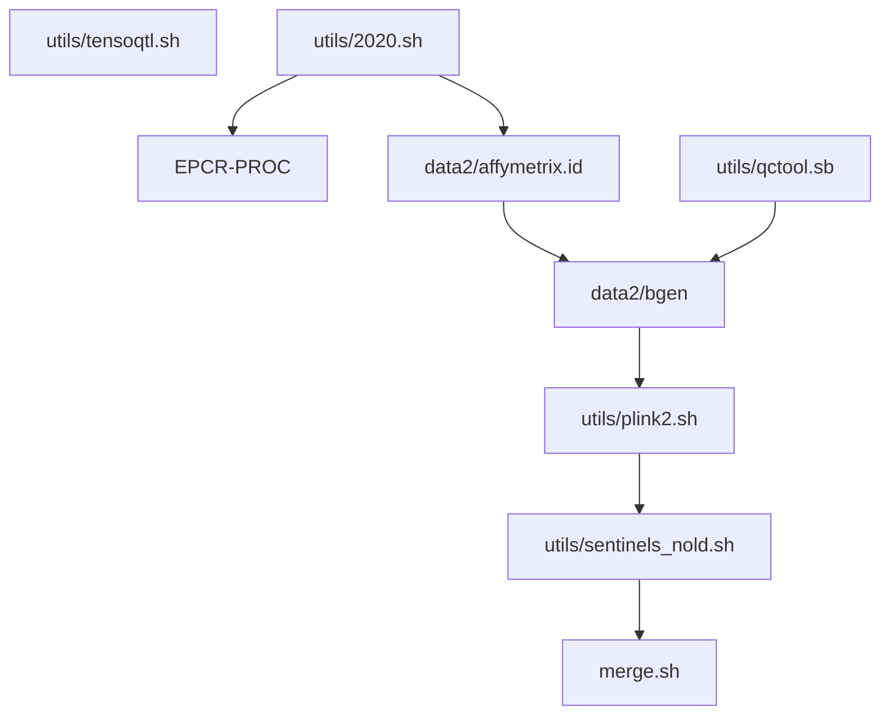
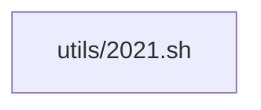

# Caprion work

## Site map

1. Phase I work (N=196)
   * data/ contains genotype files in .bgen format
   * bgen/ PLINK2 results according to .bgen files; summary outputs and sentinels/ directory are in the following directories
     * 1e-5
     * 1e-6
     * 5e-8
2. Phase II work (N=1,488)
   * data2/ contains genotype files in .bgen format
   * bgen2/ PLINK2 results according to .bgen files; summary outputs and sentinels/ directory are in the following directories
     * 1e-5
     * 5e-8
   * Comparison of Phases I and II
     * miamiplot
3. Batch 3 data (N=815)
   * data3/ .bgen data
   * bgen3/ PLINK2 results
     * 1e-5
     * 5e-8

## Coding

* Phase I work
  * [caprion.R](caprion.R) and [caprion.ini](caprion.ini) are for data processing. Their derivatives are in the utils/ subdirectory:
    * [utils/affymetrix.sh](utils/affymetrix.sh) is for variant-specific association analysis.
    * [utils/qctool.sb](utils/qctool.sb) is used to extract available sample and genotypes.
    * [utils/qctool.sh](utils/qctool.sh) further extracts genotypes with MAF 0.01 only.
    * [utils/plink2.sh](utils/plink2.sh) non-SLURM version of association analysis.
    * [utils/qqman.sh](utils/qqman.sh) and [utils/qqman.R](utils/qqman.R) produce QQ and Manhattan plots.
    * [utils/sentinels_nold.sh](utils/sentinels_nold.sh) and [utils/merge.sh](utils/merge.sh) select sentinels.
    * [utils/ps.sh](utils/ps.sh) and [utils/ps.R](utils/ps.R) run through PhenoScanner.
    * [utils/lookup.sh](utils/lookup.sh) looks up for overlap with SomaLogic and Olink.
    * [caprion.ipynb](caprion.ipynb) is a Jupyter notebook with some preprocessing done by [utils/tensorqtl.sh](utils/tensorqtl.sh).
* Phase II work

* Batch 3 work

---

## autoencoder (AE) vs PCA

As shown at <a href="https://www.r-bloggers.com/pca-vs-autoencoders-for-dimensionality-reduction/">R-bloggers</a>,

> autoencoder is better at reconstructing the original data set than PCA when k is small, 
> however the error converges as k increases. For very large data sets this difference will be
> larger and means a smaller data set could be used for the same error as PCA. When dealing 
> with big data this is an important property`.

where `k` corresponds to the number of principal components in PCA or bottleneck dimension in AE.

The local adoption is [ae_test.Rmd](utils/ae_test.Rmd) which produces [ae_test.html](utils/ae_test.html) and [ae_test.pdf](utils/ae_test.pdf).

Additional work will be on variatinoal autoencoder (VAE) as indicated in the references below.

## REFERENCES

Bludau I, Frank M, Dörig C. et al. Systematic detection of functional proteoform groups from bottom-up proteomic datasets. Nat Commun 12, 3810 (2021). https://doi.org/10.1038/s41467-021-24030-x

Hofert M, Prasad A, Zhu M (2019). Quasi-Monte Carlo for multivariate distributions viagenerative neural networks. https://arxiv.org/abs/1811.00683, https://CRAN.R-project.org/package=gnn.

Kingma DP, Welling M (2014). Auto-Encoding Variational Bayes. https://arxiv.org/abs/1312.6114, https://keras.rstudio.com/articles/examples/variational_autoencoder.html.

Trivadis SK (2017). Variational autoencoders for anomaly detection. https://rpubs.com/zkajdan/308801.

## URLs

https://github.com/diazale/gt-dimred,
https://github.com/lmcinnes/umap,
https://umap-learn.readthedocs.io/en/latest/.

---

## ETH Zurich, U Toronto Team Develops Tool for Bottom-Up Proteomics Proteoform Analysis

Jul 28, 2021 | Adam Bonislawski

NEW YORK – A team led by researchers at ETH Zurich and the University of Toronto has developed a tool that allows for the detection of protein proteoforms in bottom-up proteomics data.

Described in a paper published in June in Nature Communications, the tool, called COPF (COrrelation-based functional ProteoForm) uses peptide correlation analysis to detect differences in proteoform populations across different samples or conditions and could aid researchers as they seek to better understand the role different protein forms play in biology and disease.

The human genome is thought to have around 20,000 protein coding genes, but many of these 20,000 proteins exist in the body in various forms, differentiated by, for instance, post-translational modifications or amino acid substitutions. These different forms are called proteoforms, and it is widely believed that biological processes are guided not just by the proteins present but by what proteoforms are present and in what proportions.

Traditional bottom-up proteomics workflows have provided only limited insight into proteoform populations however, due to the fact that the presence of a particular protein is typically inferred by the detection of just a few of its peptides and that digesting proteins into peptides for mass spec analysis makes it near impossible to link a modified peptide back to a particular proteoform.

Some proteomics researchers have addressed this issue by moving to top-down proteomics, which looks at intact proteins, allowing them to better distinguish between different proteoforms. Top-down proteomics is very technically challenging, however, and is not yet able to analyze proteins with the breadth and depth of bottom-up workflows.

Recently, the development of more reproducible and higher-throughput bottom-up workflows, and particular workflows using data independent-acquisition (DIA) mass spectrometry, have allowed researchers like the Nature Communications authors to apply peptide correlation analysis to the study of proteoforms.

Peptide correlation analysis looks at differences in peptide behavior within and across proteins in bottom-up data.

Researchers have developed a number of approaches for turning peptide measurements into protein data, with most working under the assumption that peptides from the same protein will behave the same way.

In practice, though, that isn't the case. On one hand, there are a number of technical reasons why two peptides from the same protein may not behave the same way. For instance, different digestion efficiencies could lead to some peptides being more abundant than others. Different ionization efficiencies could similarly make one peptide more likely than another to be detected by the mass spec.

The presence of different proteoforms could also play a role. For instance, if a protein is present in both a full-length and truncated form, expression changes observed in the full-length form wouldn't be observable if the peptide being measured wasn't present in the truncated form. Not only would this throw off protein-level quantitation, but it would also mask relative changes in the two protein forms that could be biologically important.

A major challenge to applying this insight has been determining which differences in peptide behavior reflect real technical or biological variation and which are just noise, noted Hannes Röst, research chair in mass spectrometry-based personalized medicine at the University of Toronto and an author on the Nature Communications study.

"In many cases [such variation] was noise," he said. "When you look at traditional shotgun proteomics workflows and data analyses, really the power is not at the peptide-level quantification but at the protein level from the aggregation of multiple peptides. On the peptide level you see a lot of noise, and I think that has prevented us from using this observation that individual peptides could yield a lot of interested information because people really only looked at the protein-level data, because that is what they trusted."

Röst said that the development of targeted protein quantitation approaches like multiple-reaction monitoring (MRM) has demonstrated that individual peptides can be measured with high accuracy, and the development of DIA mass spec approaches has enabled MRM-style peptide quantitation at the proteome scale.

At the same time, improvements in mass spec technology have allowed researchers to collect the kind of large and reproducible datasets required for peptide correlation analysis, he said.

"These are types of experiments we wouldn't have imagined 10 years ago, because for correlation-based approaches to work, you need a relatively large number of samples, and you need low variance," he said. "We are not detecting [proteoforms] that are not changing between different [conditions], we are only detecting those that change. And for this to work we need to have multiple replicates and we need to have different conditions and to be able to measure these peptides with high quantitative accuracy across these conditions."

The COPF tool looks at the intensities of peptides coming from a particular protein across all the samples measured in an experiment and then calculates peptide correlations for all the pairs of peptides coming from that protein and uses hierarchical clustering to divide the peptides into two clusters. It then scores the likelihood that multiple proteoforms of a protein are present by comparing the level of peptide correlation between the clusters to the level of in-cluster variation.

The tool does not identify the specific modifications or variations that distinguish the different proteoforms but rather the peptides that appear to differentiate between the forms of the protein in the different biological contexts investigated. Analyzing a DIA dataset that looked at five different tissue types across eight different mice, COPF identified 63 proteins that exhibited different proteoform groups, including proteins with known tissue-specific splice variants. The researchers also identified proteoforms created by proteolytic and autocatalytic cleavage and phosphorylation, indicating, they wrote, that the tool is "agnostic to the different mechanisms by which proteoforms can be generated inside the cell."

The development of COPF follows the publication last year of a study by researchers at Barts Cancer Institute and the University of Wisconsin-Madison detailing another peptide correlation analysis tool for identifying proteoforms in bottom-up data called PeCorA.

Unlike COPF, which requires proteoforms to differ by two or more peptides, PeCorA can detect proteoforms based on single peptide differences. This makes it a potentially more sensitive tool but also less specific than COPF, Röst said.

More generally, he said that he expected ongoing improvements in mass spec technology would further improve peptide correlation-based approaches like COPF and PeCorA by boosting peptide coverage.

"To kind of cover every possible protein isoform we would need to have complete coverage of every protein, and unfortunately we are currently quite far away from having peptide-level coverage of every protein," he said. "I think that is currently one of the limitations where we are kind of hitting a wall."

Röst added that his lab has begun acquiring data on Bruker's timsTOF Pro platform, "and there we definitely see both an increase in protein coverage and also in the number of peptides we can measure."

"That's why I'm very optimistic that while this is just the first implementation of the method, the data we are producing at this moment is much more complete, and therefore I think it would be even more suitable to our approach than the data we used in the paper," he said.
