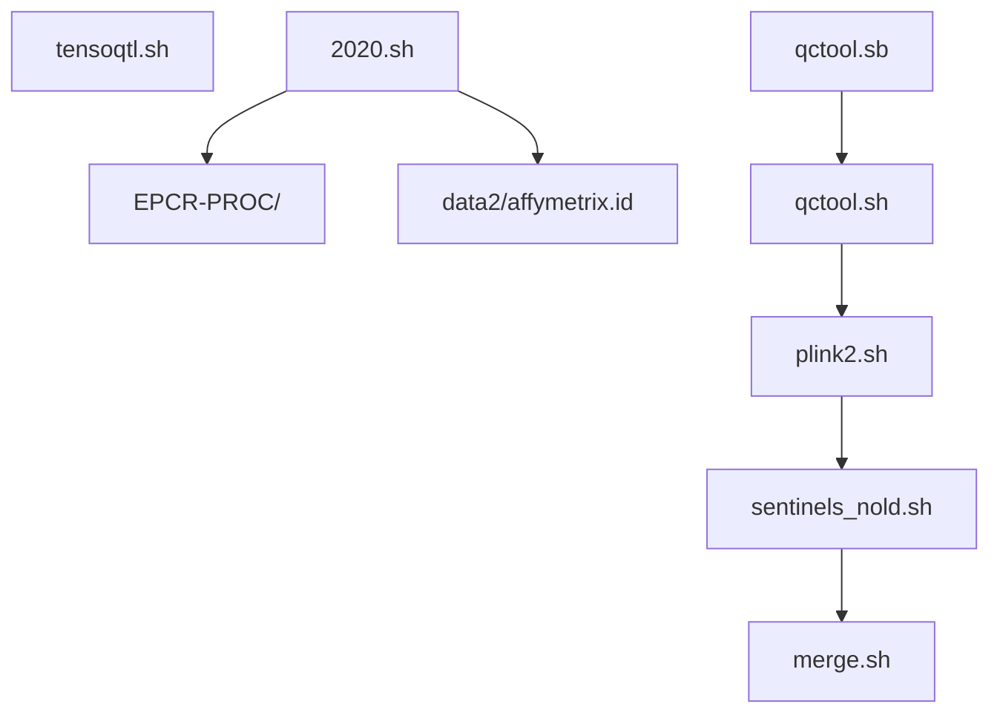
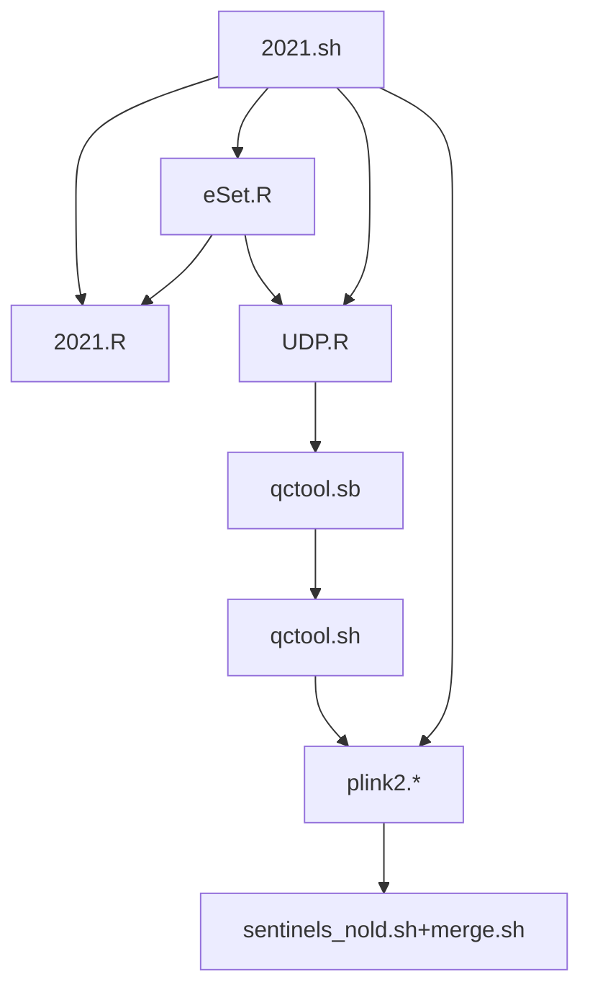

# Caprion work

## Site map

* Pilot (N=196)
    - data/ contains genotype files in .bgen format
    - bgen/ PLINK2 results according to .bgen files; summary outputs and sentinels/ directory are in the following directories
         * 1e-5
         * 1e-6
         * 5e-8
* Batch 2 (N=1,488)
    - data2/ contains genotype files in .bgen format
    - bgen2/ PLINK2 results according to .bgen files; summary outputs and sentinels/ directory are in the following directories
         * 1e-5
         * 5e-8
    - Comparison of pilot and batch 2
         * miamiplot
* Batch 3 data (N=807)
    - data3/ .bgen data
    - bgen3/ PLINK2 results
         * 1e-5
         * 5e-8

## Coding

There are apparent commonalities between batches from the list of programs and diagrams; many of which are activated as subroutines.

* Pilot
    - [caprion.R](caprion.R) and [caprion.ini](caprion.ini) are for data processing. Their derivatives are in the utils/ subdirectory:
         * [affymetrix.sh](utils/affymetrix.sh) is for variant-specific association analysis.
         * [qctool.sb](utils/qctool.sb) is used to extract available sample and genotypes.
         * [qctool.sh](utils/qctool.sh) further extracts genotypes with MAF 0.01 only.
         * [plink2.sh](utils/plink2.sh) non-SLURM version of association analysis.
         * [qqman.sh](utils/qqman.sh) and [qqman.R](utils/qqman.R) produce QQ and Manhattan plots.
         * [sentinels_nold.sh](utils/sentinels_nold.sh) and [merge.sh](utils/merge.sh) select sentinels.
         * [ps.sh](utils/ps.sh) and [ps.R](utils/ps.R) run through PhenoScanner.
         * [lookup.sh](utils/lookup.sh) looks up for overlap with SomaLogic and Olink.
         * [caprion.ipynb](caprion.ipynb) is a Jupyter notebook with some preprocessing done by [tensorqtl.sh](utils/tensorqtl.sh).
* Batch 2 (prefix=utils/ when unspecified)

* Batch 3 (prefix=utils/)

Note that `eSet.R` actually covers data from pilot, batches 2 and 3.

## Specific analyses

* []

## Reference

Klaus B, Reisenauer S (2018). [An end to end workflow for differential gene expression using Affymetrix microarrays](https://bioconductor.org/packages/devel/workflows/vignettes/maEndToEnd/inst/doc/MA-Workflow.html).
