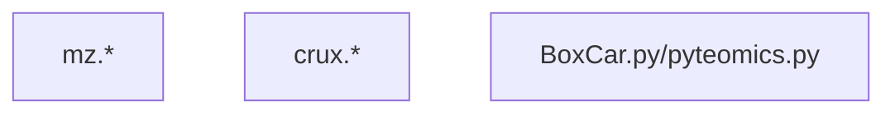

# Peptide analysis

## CSD3 directory

**/rds/project/jmmh2/rds-jmmh2-projects/Caprion_proteomics/analysis/**

## Scripts and results

The project directory above contains scripts at **peptide_progs/** and results results at **peptide/**, respectively.

These are also a set of scripts called from `bash` which invokes SLURM jobs.

Script name| Description          | Protein-specific error/output
-----------|----------------------|-----------------------------------------------------------
**Association analysis**
1_pgwas.sh | Association analysis | {protein}.e / {protein}.o
2_meta_analysis.sh | Meta-analysis| {protein}-METAL\_{SLURM\_job\_id}\_{phenotype\_number}.e / {protein}-METAL\_{SLURM\_job\_id}\_{phenotype\_number}.o
**Signal identification** (see **{protein}/sentinels/slurm**)
setup.sh | Environmental variables
3.1_extract.sh | Signal extraction | \_step1\_{SLURM\_job\_id}\_{phenotype\_number}.e / \_step1\_{SLURM\_job\_id}\_{phenotype\_number}.o
3.2_collect.sh | Signal collection/classification | \_step2\_{protein}.e / \_step2\_{protein}.o
3.3_plot.sh | Forest, Q-Q, Manhattan, LocusZoom, mean-by-genotype/dosage plots | \_step3\_{SLURM\_job\_id}\_{phenotype\_number}.e / \_step3\_{SLURM\_job\_id}\_{phenotype\_number}.o
utils.sh | Various utitlties

    

        graph TD;
            1_pgwas.sh
            2_meta_analysis.sh
            1_pgwas.sh --> 2_meta_analysis.sh --> setup.sh
            setup.sh --> 3.1_extract.sh
            setup.sh --> 3.2_collect.sh
            setup.sh --> 3.3_plot.sh

            subgraph Group1[ ]
                direction LR
                3.1_extract.sh --> 3.2_collect.sh --> 3.3_plot.sh
            end

            utils.sh
    

Specfic prerequistes for a Manhattan/peptide association plot are

- a call to vep_annotate functino in `3.2_collect.sh` for proteins.
- a call to `bgz()` (in `utils.sh` for protein) for a indexed and compressed DR-filtered data.
- for step 3.2, `ceuadmin/ensembl-vep/111-icelake` now is the default since partition `icelake-himem` is used instead of `cclake` (CentOS 7) which has `ceuadmin/ensembl-vep/104`.
- module `ceuadmin/R/4.4.1-icelake` now works as smoothly as the old `ceuadmin/R` at `cclake`

Script name| Description          | Protein-specific error/output
-----------|----------------------|-----------------------------------------------------------
 **Experimental codes**
mz.* | file handling & MetaMorpheus, MSAmanda. | mzML and results in */metamorpheus, msamonda
crux.*  | search, R/multicomp+crux benchmark | crux/
BoxCar.py/pyteomics.py | BoxCar algorighm and its use
pyopenms.py | pyOpenMS script

The module `mono-5.10.0.78-gcc-5.4.0-c6cq4hh` is required for `rawrr`, to `${HOME}/.cache/R/rawrr/rawrrassembly` (4/8/2024).

File   | Size
--------|---------------------------------------------------
eula.txt | 163
rawrr.exe | 28672
ThermoFisher.CommonCore.BackgroundSubtraction.dll | 44544
ThermoFisher.CommonCore.Data.dll | 406016
ThermoFisher.CommonCore.MassPrecisionEstimator.dll | 11264
ThermoFisher.CommonCore.RawFileReader.dll | 654336

Finally, `ceumadin/FragPipe/22.0` is available as a GUI for experiments on various worflows.

## Glossary

The atomic mass unit (dalton) is equal to the mass of one-twelvth of the mass of a $^{12}C$ atom ($1.660 540 2 \times 10^{-27}$g).

## References

Bittremieux W, Levitsky L, Pilz M, Sachsenberg T, Huber F, Wang M, Dorrestein PC. Unified and standardized mass spectrometry data processing in Python using spectrum_utils. *J Proteome Res* 22:625–631 (2023), <https://doi.org/10.1021/acs.jproteome.2c00632>, <https://spectrum-utils.readthedocs.io/en/latest/>.

Eidhammer I, Flikka K, Martens L, Mikalsen S-O. Computational Methods for Mass Spectrometry Proteomics. Wiley, 2007. ISBN: 978-0-470-51297-5

1. Peptides are the short stretches of amino acids that are obtained after the proteolytic cleavage of proteins. Peptides are usually around 10–15 amino acids long, and a single protein yields approximately 35 peptides on average.

2. The mass (m) of a molecule or atom is expressed in unified atomic mass units (u).

3. Isotopes are (chemical) elements that have the same atomic number (and therefore similar chemical properties), but different molecular mass (slightly different physical properties).

4. Monoisotopic mass is the exact mass of an ion or molecule calculated using the mass of the most abundant isotope of each element.

5. A posttranslational modification (PTM) can be defined as any alteration to the chemical structure of the protein effected by the cellular machinery after the formation of the protein.

6. The raw data spectrum contains signals from the peptides, as well as signals derived from different forms of noise.

fragpipe.nesvilab.org, <https://fragpipe.nesvilab.org/>

Hasam S, Emery K, Noble WS, Keich U. A Pipeline for Peptide Detection Using Multiple Decoys. *Methods Mol Biol* 2023;2426:25-34, [doi: 10.1007/978-1-0716-1967-4_2](https://link.springer.com/protocol/10.1007/978-1-0716-1967-4_2).

The most common method of peptide and protein False Discovery Rate (FDR) calculation is by adding protein sequences that are not expected to be present in the sample. These are also called decoy protein sequences. This can be done by generating reverse sequences of the target protein entries and appending these protein entries to the protein database. Some search algoritmms use premade target-decoy protein sequences while others can generate a target-decoy protein sequence database from a target protein sequence database before using them for peptide spectral matching.

Kertesz-Farkas A, Nii Adoquaye Acquaye FL, Bhimani K, Eng JK, Fondrie WE, Grant C, Hoopmann MR, Lin A, Lu YY, Moritz RL, MacCoss MJ, Noble WS. The Crux Toolkit for Analysis of Bottom-Up Tandem Mass Spectrometry Proteomics Data. *J Proteome Res* 2023;22(2):561-569, <https://doi.org/10.1021/acs.jproteome.2c00615>, <https://crux.ms>.

Lazear MR. Sage: An Open-Source Tool for Fast Proteomics Searching and Quantification at Scale. *J Proteome Res* 2023 22 (11), 3652-3659, [DOI: 10.1021/acs.jproteome.3c00486](https://pubs.acs.org/doi/10.1021/acs.jproteome.3c00486).

Levitsky LI, Klein JA, Ivanov MV, Gorshkov MV. Pyteomics 4.0: Five Years of Development of a Python Proteomics Framework. *J Proteome Res.* 2019;18(2):709-714. [doi: 10.1021/acs.jproteome.8b00717](https://pubs.acs.org/doi/10.1021/acs.jproteome.8b00717), <https://github.com/levitsky/pyteomics>.

ms-utils.org, <https://ms-utils.org/>.

Rehfeldt TG, Gabriels R, Bouwmeester R, Gessulat S, Neely BA, Palmblad M, Perez-Riverol Y, Schmidt T, Vizcaíno JA, Deutsch EW. ProteomicsML: An Online Platform for Community-Curated Data sets and Tutorials for Machine Learning in Proteomics. *J Proteome Res*, 2023;22(2):632-636, <https://doi.org/10.1021/acs.jproteome.2c00629>, <https://proteomicsml.org/>.

Sturm M, Bertsch A, Gröpl C, Hildebrandt A, Hussong R, Lange E, Pfeifer N, Schulz-Trieglaff O, Zerck A, Reinert K, Kohlbacher O. OpenMS - an open-source software framework for mass spectrometry. *BMC Bioinformatics*. 2008;9:163. [doi: 10.1186/1471-2105-9-163](https://bmcbioinformatics.biomedcentral.com/articles/10.1186/1471-2105-9-163).
