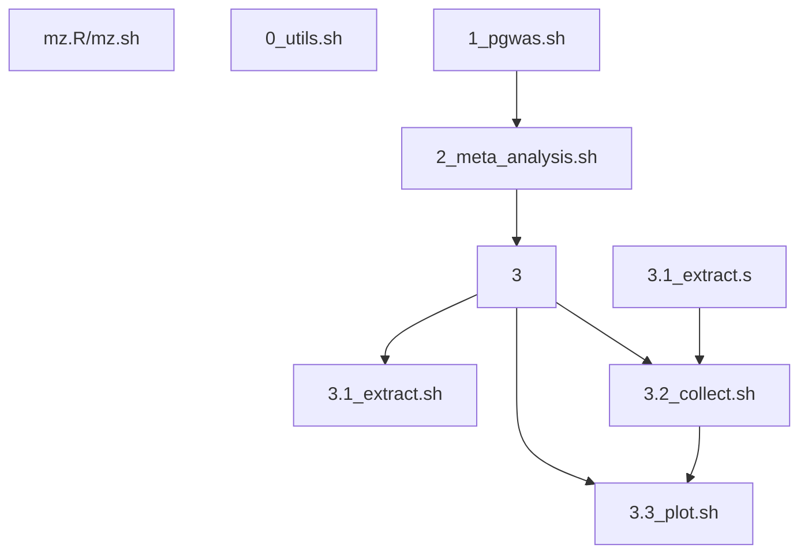

# Peptide analysis

## CSD3 directory

**/rds/project/jmmh2/rds-jmmh2-projects/Caprion_proteomics/analysis/**

## Scripts and results

The project directory above contains scripts at **peptide_progs/** and results results at **peptide/**, respectively.

These are also a set of scripts called from `bash` which invokes SLURM jobs.

Script name| Description          | Protein-specific error/output
-----------|----------------------|-----------------------------------------------------------
mz.R/mz.sh | handling of files in .raw and other formats
crux.R/crux.sh | R/multicomp+crux pipeline
0_utils.sh | Code snippets
1_pgwas.sh | Association analysis[^association] | {protein}.e / {protein}.o
2_meta_analysis.sh | Meta-analysis| {protein}-METAL\_{SLURM\_job\_id}\_{phenotype\_number}.e / {protein}-METAL\_{SLURM\_job\_id}\_{phenotype\_number}.o
3 | Signal identification[^location]
3.1_extract.sh | Signal extraction | \_step1\_{SLURM\_job\_id}\_{phenotype\_number}.e / \_step1\_{SLURM\_job\_id}\_{phenotype\_number}.o
3.2_collect.sh | Signal collection/classification | \_step2\_{protein}.e / \_step2\_{protein}.o
3.3_plot.sh | Forest, Q-Q, Manhattan, LocusZoom, mean-by-genotype/dosage plots | \_step3\_{SLURM\_job\_id}\_{phenotype\_number}.e / \_step3\_{SLURM\_job\_id}\_{phenotype\_number}.o

Prerequistes for a Manhattan/peptide association plot are

- a call to `gz()` (in `0_utils.sh` for protein) for a compressed DR-filtered data.
- ensembl-vep (step 3.2 above)[^vep], for which `ceuadmin/ensembl-vep/111-icelake` now is the default since partition `icelake-himem` is called.

The CSD3 icelake module `ceuadmin/R/4.4.1-icelake` now works as smoothly as the old `ceuadmin/R` at `cclake` (CentOS 7).

## Reference

Hasam S, Emery K, Noble WS, Keich U. A Pipeline for Peptide Detection Using Multiple Decoys. Methods Mol Biol. 2023;2426:25-34. [doi: 10.1007/978-1-0716-1967-4_2](https://link.springer.com/protocol/10.1007/978-1-0716-1967-4_2). PMID: 36308683.

## Footnotes

[^association]: **Association**

    Accidentally, they were removed for the benchmarks: A1BG, APOB EPCR, ERAP2, PROC.

[^location]: **Location**

    **{protein}/sentinels/slurm**

[^vep]: **ensembl-vep**

    This is possible since plugin `Set::IntervalTree` has been made available. For cclake, one uses `ceuadmin/ensembl-vep/104`.
