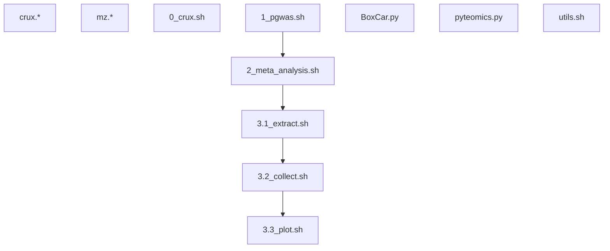

# Peptide analysis

## CSD3 directory

**/rds/project/jmmh2/rds-jmmh2-projects/Caprion_proteomics/analysis/**

## Scripts and results

The project directory above contains scripts at **peptide_progs/** and results results at **peptide/**, respectively.

These are also a set of scripts called from `bash` which invokes SLURM jobs.

Script name| Description          | Protein-specific error/output
-----------|----------------------|-----------------------------------------------------------
Experimental codes |
mz.* | handling of files in .raw and other formats
crux.* | R/multicomp+crux benchmarks
BoxCar.py/pyteomics.py | BoxCar algorighm and its use
utils.sh | Various utitlties
0_crux.sh | crux search | crux/*.e/.o
Association analysis |
1_pgwas.sh | Association analysis | {protein}.e / {protein}.o
2_meta_analysis.sh | Meta-analysis| {protein}-METAL\_{SLURM\_job\_id}\_{phenotype\_number}.e / {protein}-METAL\_{SLURM\_job\_id}\_{phenotype\_number}.o
Signal identification | see **{protein}/sentinels/slurm**
3.1_extract.sh | Signal extraction | \_step1\_{SLURM\_job\_id}\_{phenotype\_number}.e / \_step1\_{SLURM\_job\_id}\_{phenotype\_number}.o
3.2_collect.sh | Signal collection/classification | \_step2\_{protein}.e / \_step2\_{protein}.o
3.3_plot.sh | Forest, Q-Q, Manhattan, LocusZoom, mean-by-genotype/dosage plots | \_step3\_{SLURM\_job\_id}\_{phenotype\_number}.e / \_step3\_{SLURM\_job\_id}\_{phenotype\_number}.o

The crux search is experimental and along with ongoing effort on visualization. Specfically, prerequistes for a Manhattan/peptide association plot are

- a call to vep_annotate functino in `0_utils.sh` for proteins.
- a call to `bgz()` (in `utils.sh` for protein) for a indexed and compressed DR-filtered data.
- for step 3.2, `ceuadmin/ensembl-vep/111-icelake` now is the default since partition `icelake-himem` is used instead of `cclake` (CentOS 7) which has `ceuadmin/ensembl-vep/104`.
- module `ceuadmin/R/4.4.1-icelake` now works as smoothly as the old `ceuadmin/R` at `cclake`
- module `mono-5.10.0.78-gcc-5.4.0-c6cq4hh` is required for `rawrr`, to `${HOME}/.cache/R/rawrr/rawrrassembly` (4/8/2024)

    File   | Size
    --------|---------------------------------------------------
    eula.txt | 163
    rawrr.exe | 28672
    ThermoFisher.CommonCore.BackgroundSubtraction.dll | 44544
    ThermoFisher.CommonCore.Data.dll | 406016
    ThermoFisher.CommonCore.MassPrecisionEstimator.dll | 11264
    ThermoFisher.CommonCore.RawFileReader.dll | 654336

## References

Bittremieux W, Levitsky L, Pilz M, Sachsenberg T, Huber F, Wang M, Dorrestein PC. Unified and standardized mass spectrometry data processing in Python using spectrum_utils. *J Proteome Res* 22:625–631 (2023), <https://doi.org/10.1021/acs.jproteome.2c00632>, <https://spectrum-utils.readthedocs.io/en/latest/>.

Hasam S, Emery K, Noble WS, Keich U. A Pipeline for Peptide Detection Using Multiple Decoys. *Methods Mol Biol* 2426:25-34 (2023), [doi: 10.1007/978-1-0716-1967-4_2](https://link.springer.com/protocol/10.1007/978-1-0716-1967-4_2).

> The most common method of peptide and protein False Discovery Rate (FDR) calculation is by adding protein sequences that are not expected to be present in the sample. These are also called decoy protein sequences. This can be done by generating reverse sequences of the target protein entries and appending these protein entries to the protein database. Some search algoritmms use premade target-decoy protein sequences while others can generate a target-decoy protein sequence database from a target protein sequence database before using them for peptide spectral matching.

Kertesz-Farkas A, Nii Adoquaye Acquaye FL, Bhimani K, Eng JK, Fondrie WE, Grant C, Hoopmann MR, Lin A, Lu YY, Moritz RL, MacCoss MJ, Noble WS. The Crux Toolkit for Analysis of Bottom-Up Tandem Mass Spectrometry Proteomics Data. *J Proteome Res* 22(2):561-569 (2023), <https://doi.org/10.1021/acs.jproteome.2c00615>, <https://crux.ms>.

Levitsky LI, Klein J, Ivanov, MV, Gorshkov MV. Pyteomics 4.0: five years of development of a Python proteomics framework, *J Proteome Res* 2018, <https://doi.org/10.1021/acs.jproteome.8b00717>, <https://pyteomics.readthedocs.io/en/latest/>

ms-utils.org, <https://ms-utils.org/>.

Rehfeldt TG, Gabriels R, Bouwmeester R, Gessulat S, Neely BA, Palmblad M, Perez-Riverol Y, Schmidt T, Vizcaíno JA, Deutsch EW. ProteomicsML: An Online Platform for Community-Curated Data sets and Tutorials for Machine Learning in Proteomics. *J Proteome Res*, 22(2):632-636 (2023), <https://doi.org/10.1021/acs.jproteome.2c00629>, <https://proteomicsml.org/>.
