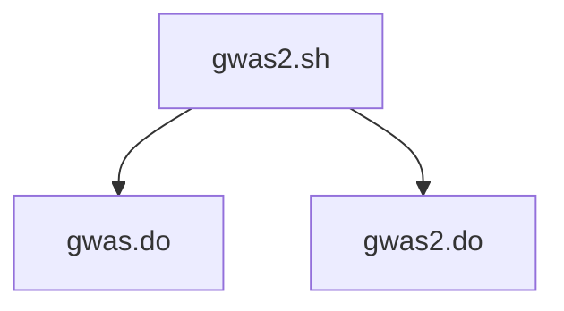

# gwas2

This is a promising alternative showing through RCN3/FCGRN with [gwas2.sh](gwas2.sh).

where `gwas.do` (`caprion.dat` also contains _invn data) and `gwas2.do` (`gwas2_invn.do` for _invn data) are for the pilot and batch 2 data, respectively.

See [gwas2](https://jinghuazhao.github.io/gwas2/) repository for additional information.
